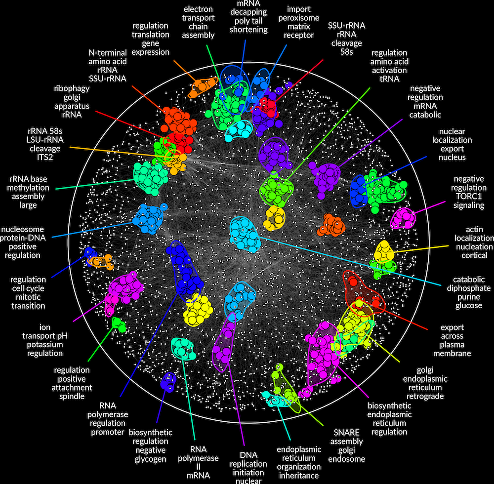
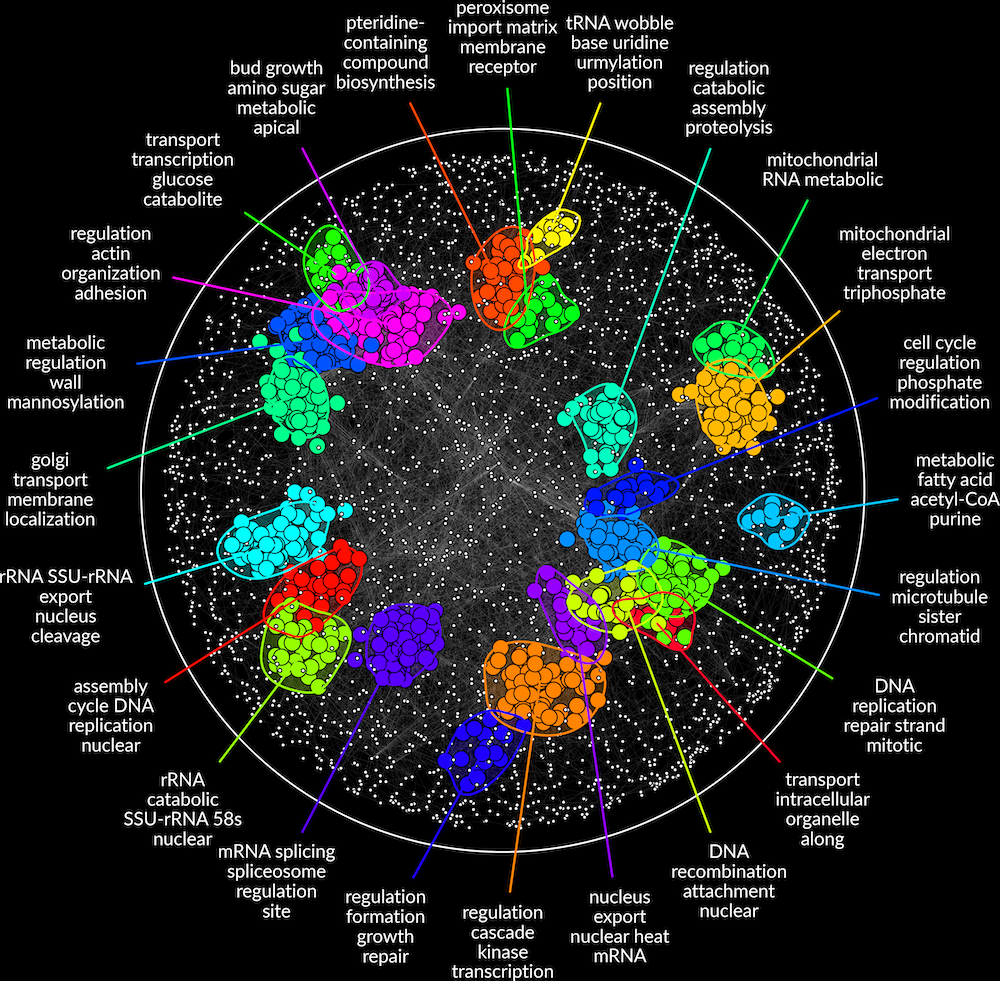
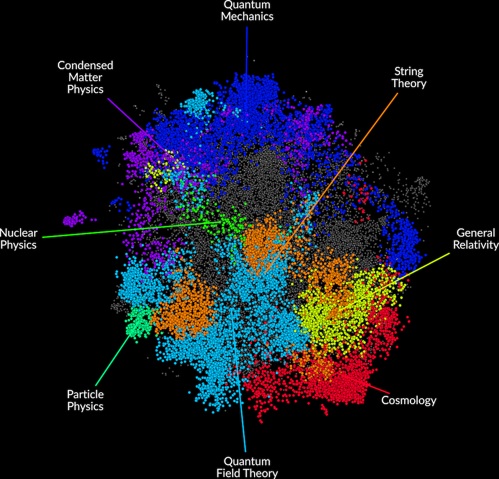
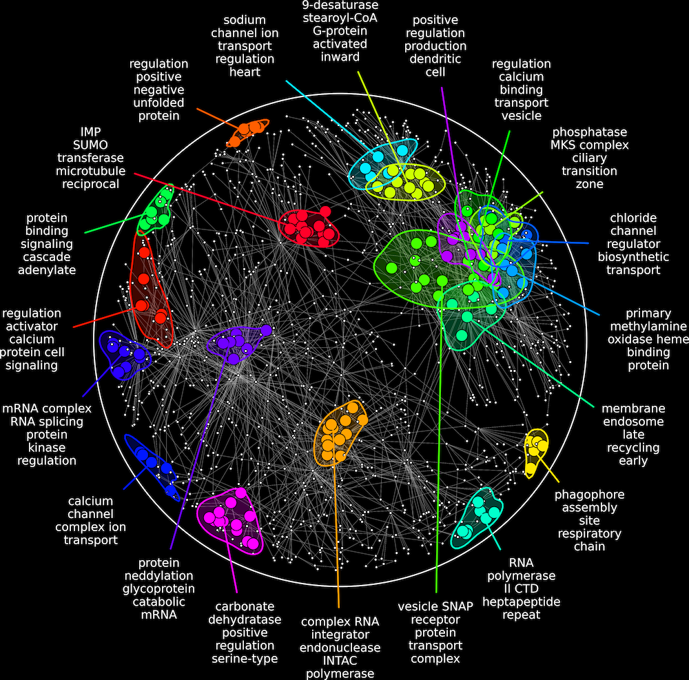

# Figure Gallery

Browse selected RISK figures across yeast, physics, and HuRI analyses.

## Gallery

  

    

      <strong>Figure 1B.</strong> Yeast PPI network.
      Annotation source: GO BP (yeast)
    

    
  

  

    

      <strong>Supplementary Figure S1.</strong> Yeast GI network.
      Annotation source: GO BP (yeast)
    

    
  

  

    

      <strong>Supplementary Figure S7.</strong> Physics citation network.
      Annotation source: Research subfields
    

    
  

  

    

      <strong>HuRI:</strong> Human brain cerebellum network.
      Annotation source: GO BP (human)
    

    
  

## Citations

**Figures 1B, S1, and S7**
 
Horecka, I., and Röst, H. (2026)
 
_RISK: a next-generation tool for biological network annotation and visualization_
 
_Bioinformatics_. [https://doi.org/10.1093/bioinformatics/btaf669](https://doi.org/10.1093/bioinformatics/btaf669)

**Human HuRI brain cerebellum**
 
Luck, K., Kim, DK., Lambourne, L. et al. (2020)
 
_A reference map of the human binary protein interactome_
 
_Nature_ 580, 402-408. [https://doi.org/10.1038/s41586-020-2188-x](https://doi.org/10.1038/s41586-020-2188-x)
 
Note: Panel generated with RISK from a HuRI-derived brain cerebellum PPI network dataset; not reproduced from a figure in Luck _et al_. (2020).

---

## Next Step

[Overview of `risk.params`](8_parameters.md)
