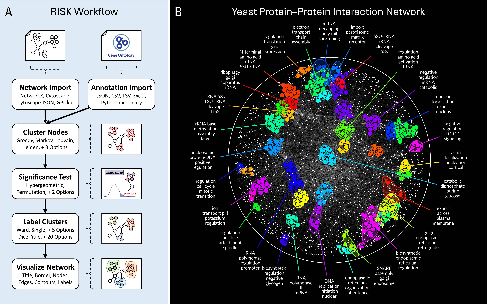

# Welcome to RISK Documentation

**RISK** (Regional Inference of Significant Kinships) is a modular, scalable tool for biological network annotation and visualization. It combines community detection, rigorous statistical testing, and high-resolution visualization to resolve functional modules and uncover biologically meaningful relationships. RISK scales efficiently to large networks, adapts across diverse data types, and produces publication-ready figures.

RISK is compatible with Python 3.8 or later, supports all major operating systems, and can be installed via pip. The software is open source under the GPLv3 license on [GitHub](https://github.com/riskportal/risk).

**RISK workflow overview and analysis of the _Saccharomyces cerevisiae_ protein–protein interaction (PPI) network.** RISK identifies biologically coherent modules overrepresented in Gene Ontology Biological Process (GO BP; Ashburner _et al_., 2000), highlighting cellular organization such as ribosomal assembly, mitochondrial organization, and RNA polymerase activity.

## Getting Started

Begin here for setup and core concepts:

- [0. Introduction](0_introduction.md): Overview of RISK and key principles
- [1. Installation](1_installation.md): Install RISK on your system

Interactive tutorials:

- <a href="https://mybinder.org/v2/gh/riskportal/risk-docs/HEAD?filepath=notebooks/quickstart.ipynb" target="_blank" rel="noopener">Launch Quickstart in Binder</a> (no installation required)
- [Full Tutorial (HTML)](tutorial.html)
- [Download Tutorial + Data (ZIP)](tutorial.zip)

## Core Features

- [2. Network Input](2_network_input.md)
- [3. Annotation Input](3_annotation_input.md)
- [4. Clustering & Statistics](4_clustering_statistics.md)
- [5. Analyzing Results](5_analyzing_results.md)
- [6. Visualization](6_visualization.md)
- [7. Analysis Parameters](7_parameters.md)

---

For interactive examples, use [tutorial.zip](tutorial.zip) in Jupyter or view the [static HTML version](tutorial.html).

Contributions are welcome on [GitHub](https://github.com/riskportal/risk-docs).
Explore the [RISK source code](https://github.com/riskportal/risk).
